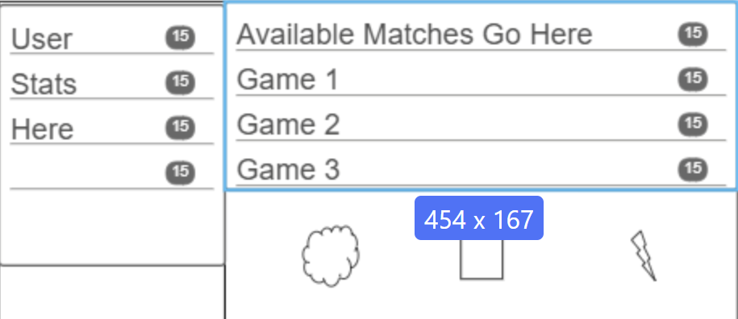
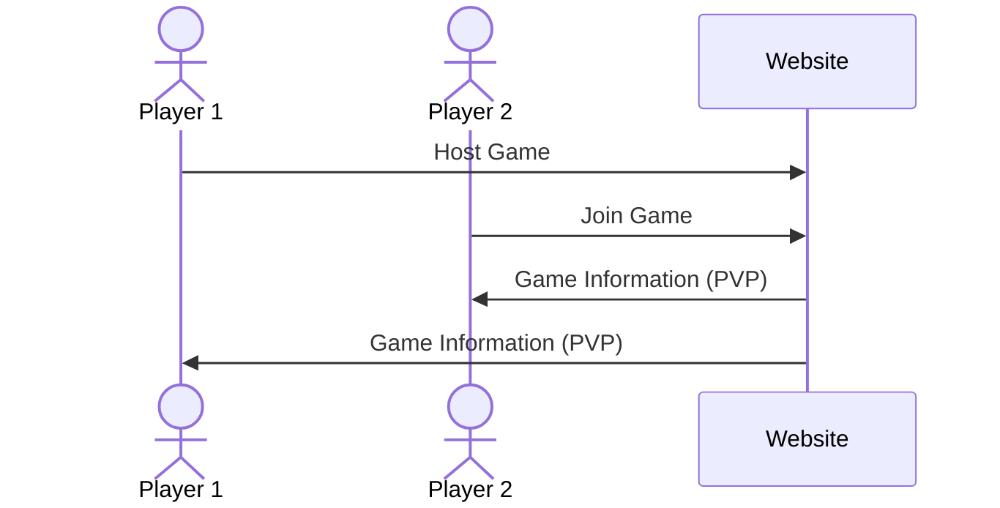

# RPS Infinite

[My Notes](notes.md)

## 🚀 Specification Deliverable

> [!NOTE]
>  Fill in this sections as the submission artifact for this deliverable. You can refer to this [example](https://github.com/webprogramming260/startup-example/blob/main/README.md) for inspiration.

For this deliverable I did the following. I checked the box `[x]` and added a description for things I completed.

- [x] Proper use of Markdown
- [x] A concise and compelling elevator pitch
- [x] Description of key features
- [x] Description of how you will use each technology
- [x] One or more rough sketches of your application. Images must be embedded in this file using Markdown image references.

### Elevator pitch

The culture behind online gaming, while trending to the complex, still has niches where the simple can shine. This is especially true for games the average individual has an understanding of, like rock, paper, scissors. Users can compete against each other live in a simple game, and have their winrate for  each option (rock, paper, scissors) displayed to them as proof of their mastery of the age old children's game.

### Design

The following is a roughed diagram outlining interaction of users with the site.

### Key features

- Account creation and login for account
- Room hosting and management of personal game
- Live gameplay against another player (PVP)
- Tracking wins used for each game option
- Changing visuals user side based on progress/proficiency

### Technologies

I am going to use the required technologies in the following ways.

- **HTML** - Page design for login, room catalog, and game room.
- **CSS** - Will ensure webpage adaptability to differing screen sizes and assist with general qol aesthetic choices in color and space.
- **React** - Used for login interface, button access for gameplay and room controls, and diplay of gameplay to players.
- **Service** - Backend services for the following endpoints:
    - login
    - game room management
    - handling player choices correctly
- **DB/Login** - Database storage and managemenf ro the following:
    - secure account storage
    - win tracking
    - visual asset management
- **WebSocket** - Reporting to each player their opponent's actions during a game.

## 🚀 AWS deliverable

For this deliverable I did the following. I checked the box `[x]` and added a description for things I completed.

- [x] **Server deployed and accessible with custom domain name** - [My server link](https://gunutils.click).

## 🚀 HTML deliverable

For this deliverable I did the following. I checked the box `[x]` and added a description for things I completed.

- [x] **HTML pages** - Pages made for login and game room, current plan is to have the games take place in the same window as lobby selection. This is subject to change if unrealistic to implement.
- [x] **Proper HTML element usage** - HTML files written with regard to readability. Rubric required elements included.
- [x] **Links** - Application has two windows; link to lobby included to bypass login. Github link included on lobby page.
- [x] **Text** - Layout and UI element locations denoted with text.
- [x] **3rd party API placeholder** - Currently planning on using opensource API by neogeek for lobby/player management [API Github](https://github.com/neogeek/websocket-game-lobby)
- [x] **Images** - Placeholder icons for game inputs included.
- [x] **Login placeholder** - Included HTML page for login.
- [x] **DB data placeholder** - Placeholders included for both display (username display) and storage (user registration).
- [x] **WebSocket placeholder** - Websocket communication placeholder included for live game selection.

## 🚀 CSS deliverable

For this deliverable I did the following. I checked the box `[x]` and added a description for things I completed.

- [x] **Header, footer, and main content body** - HTML cleaned up and formatting/classes moved to CSS format via rewrite. CSS content rewritten for visual quality
- [x] **Navigation elements** - Log Out button added to lobby page, justified by the existence of only one application page outside of Login. Login bypass flavor text changed.
- [x] **Responsive to window resizing** - Continued usage of flex for resizable pages; all flex formatting moved to CSS
- [x] **Application elements** - The lobby_and_game page retained the fundamental layout as in the HTML deliverable. Flex formatting refined for clarity and aesthetics, React section of the lobby_and_game page sized to fill a greater proportion of the page.
- [x] **Application text content** - Text edited to be as specific as possible without use of a database
- [x] **Application images** - cleaner images inserted in place of old placeholders.

## 🚀 React part 1: Routing deliverable

For this deliverable I did the following. I checked the box `[x]` and added a description for things I completed.

- [x] **Bundled using Vite** - Site built with vite ("npm run build" run in deployment script). Directories set up properly
- [x] **Components** - Multiple traversable pages built from .jsx/.css.
- [x] **Router** - App component nav bar implemented to route through various components.

## 🚀 React part 2: Reactivity deliverable

For this deliverable I did the following. I checked the box `[x]` and added a description for things I completed.

- [ ] **All functionality implemented or mocked out** - I did not complete this part of the deliverable.
- [ ] **Hooks** - I did not complete this part of the deliverable.

## 🚀 Service deliverable

For this deliverable I did the following. I checked the box `[x]` and added a description for things I completed.

- [ ] **Node.js/Express HTTP service** - I did not complete this part of the deliverable.
- [ ] **Static middleware for frontend** - I did not complete this part of the deliverable.
- [ ] **Calls to third party endpoints** - I did not complete this part of the deliverable.
- [ ] **Backend service endpoints** - I did not complete this part of the deliverable.
- [ ] **Frontend calls service endpoints** - I did not complete this part of the deliverable.
- [ ] **Supports registration, login, logout, and restricted endpoint** - I did not complete this part of the deliverable.

## 🚀 DB deliverable

For this deliverable I did the following. I checked the box `[x]` and added a description for things I completed.

- [ ] **Stores data in MongoDB** - I did not complete this part of the deliverable.
- [ ] **Stores credentials in MongoDB** - I did not complete this part of the deliverable.

## 🚀 WebSocket deliverable

For this deliverable I did the following. I checked the box `[x]` and added a description for things I completed.

- [ ] **Backend listens for WebSocket connection** - I did not complete this part of the deliverable.
- [ ] **Frontend makes WebSocket connection** - I did not cowmplete this part of the deliverable.
- [ ] **Data sent over WebSocket connection** - I did not complete this part of the deliverable.
- [ ] **WebSocket data displayed** - I did not complete this part of the deliverable.
- [ ] **Application is fully functional** - I did not complete this part of the deliverable.
